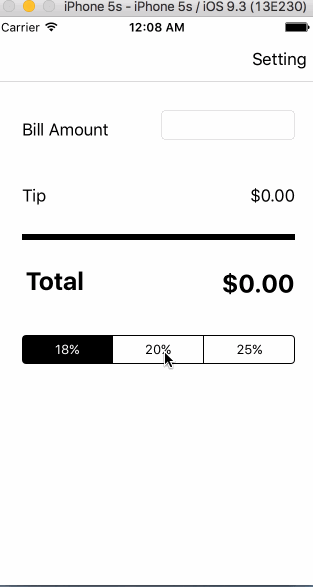

# Pre-work - *Tips*

**Tips** is a tip calculator application for iOS.

Submitted by: **Long Hoang** @longhn

Time spent: **6** hours spent in total

## User Stories

The following **required** functionality is complete:

* [x] User can enter a bill amount, choose a tip percentage, and see the tip and total values.
* [x] Settings page to change the default tip percentage and default for bill amount

The following **optional** features are implemented:
* [x] UI animations for label text field and tip controls

## Walkthrough 

Here's a walkthrough of implemented user stories:

GIF created with [LiceCap](http://www.cockos.com/licecap/).

## Notes

I am newbie to Swift and iOS, so it takes me a while to complete the assignment.

## License

    Copyright 2016 Long Hoang

    Licensed under the Apache License, Version 2.0 (the "License");
    you may not use this file except in compliance with the License.
    You may obtain a copy of the License at

        http://www.apache.org/licenses/LICENSE-2.0

    Unless required by applicable law or agreed to in writing, software
    distributed under the License is distributed on an "AS IS" BASIS,
    WITHOUT WARRANTIES OR CONDITIONS OF ANY KIND, either express or implied.
    See the License for the specific language governing permissions and
    limitations under the License.
